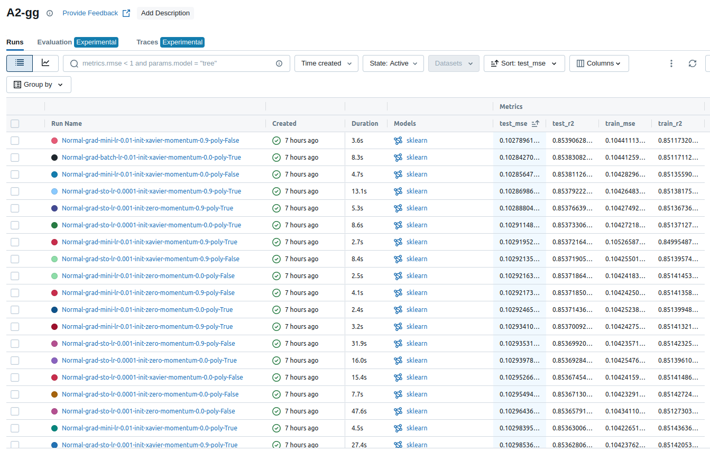

# A2 Assignment Report and Usage  

**Name:** Kaung Htet Cho  
**Student ID:** st124092  

---

## Task 1: Implementation  
The work for Task 1 is documented in the following file:  
**`A2_KaungHtetCho/notebooks/A2_Predicting_Car_Price_New.ipynb`**  

---

## Task 2: Experiments  

### 1. Experimental Setup  
In this experiment, I evaluated different regression models using cross-validation and MLflow logging. The models were compared based on the following hyperparameters:  

- **Regression Models:** Normal, Lasso, Ridge, Polynomial Regression  
- **Momentum Values:** 0.0, 0.9  
- **Gradient Descent Methods:** Stochastic (sto), Mini-Batch (mini), Batch  
- **Weight Initialization Methods:** Zero, Xavier  
- **Learning Rates:** 0.01, 0.001, 0.0001  
- **Polynomial Features:** With and without polynomial transformation  

For each experiment, we logged the following metrics in **MLflow**:  

- **Mean Squared Error (MSE):** Measures how far predictions are from actual values. Lower is better.  
- **R² Score (R2):** Measures how well the model explains variance in the data. Higher is better.  

---

### 2. Best Performing Model  
From the experiments, the best performing model was:  

<div align="center">



</div>


**Model:** `normal-mini-0.01-xavier-momentum-0.9-poly-false`  
**Test MSE:** *0.1028*  
**Test R² Score:** *0.8539*  

**The best model performed well because::**  
1. **Mini-Batch Gradient Descent:** provided a balance between speed and stability.
2. **Momentum (0.9):** Helps the model escape local minima and speeds up convergence.  
3. **Xavier Initialization:** Prevented vanishing or exploding gradients.
4. **Learning Rate (0.01):** Provides a good tradeoff between convergence speed and stability.  
5. **No Polynomial Features:** Reduced overfitting and kept the model simple.

---
### 3. Feature Importance 
In this assignment, I've choose `max_power`, `engine`, `year`, `mileage` features as my correlation matrix. Below in feature importance image 

<div align="center">


</div>

---

### 4. Model Performance Comparison  
Below is a summary of the top models:

| Model Configuration                                    | Test MSE  | Test R²  |
|--------------------------------------------------------|-----------|----------|
| **Normal - Mini - 0.01 - Xavier - Momentum 0.9 - No Poly**  | **0.1028** | **0.8539** |
| Normal - Batch - 0.01 - Xavier - Momentum 0.0 - Poly  | 0.1028    | 0.8538   |
| Normal - Stochastic - 0.001 - Zero - Momentum 0.9 - No Poly | 0.1029    | 0.8536   |
| Ridge - Mini - 0.001 - Xavier - Momentum 0.9 - Poly  | 0.1030    | 0.8535   |
| Lasso - Stochastic - 0.0001 - Zero - Momentum 0.0 - Poly  | 0.1031    | 0.8534   |

**Insights:**  
- **Polynomial transformation did not improve results.**  
- **Mini-batch performed consistently well across all models.**  
- **Momentum of 0.9 helped in Normal regression but was not as impactful in Lasso/Ridge.**  


### Task 3: Deployment
The web contains two page for old and new results

The Docker container is built and pushed to Docherhub using
```bash
sh A2_KaungHtetCho/script/build_push_prod_img.sh
```
I've created docker-compose at mlbrain server and 

```bash
docker compose up -d
```

you can access the deployed application through 

[**st124092.ml.brain.cs.ait.ac.th**](https://st124092.ml.brain.cs.ait.ac.th)


<div align="center">


</div>


